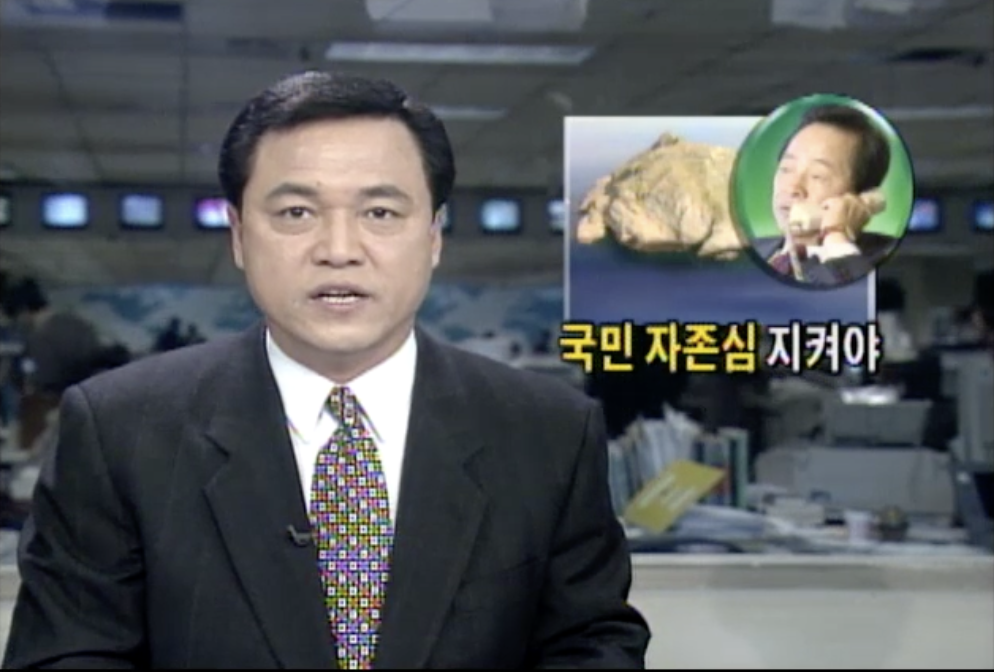
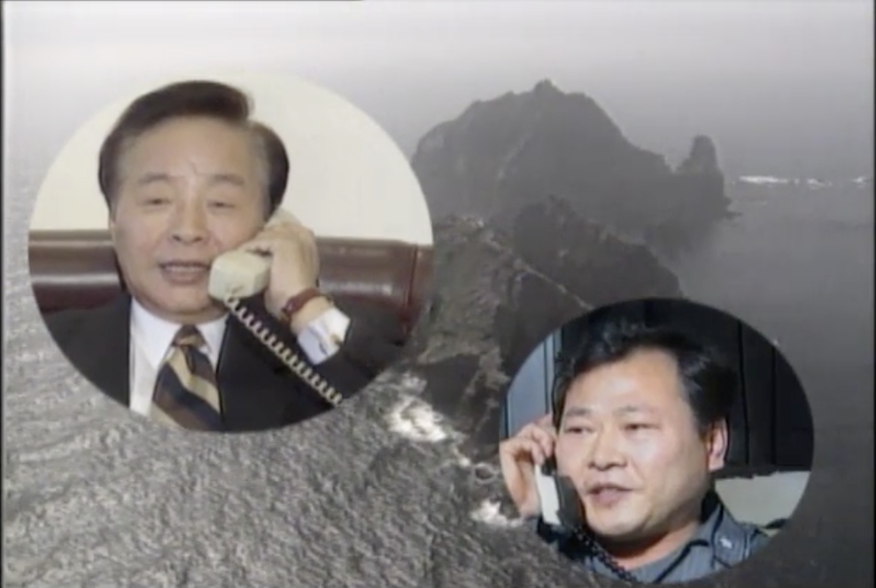

## Overview

My research explores the interplay between domestic and international politics, seeking to understand, first, when and why foreign affairs becomes salient in the national dialogue, and, second, the ways in which the political climate at home affects state behavior on the international stage. With a substantive focus on East Asia, my dissertation examines first, when and where states strategically pursue aggressive foreign policy for domestic ends, leveraging interstate rivalry to amplify perceptions of foreign threat and rile anti-foreign nationalism, and second, how citizens respond in ways that affect larger political landscapes both home and abroad. 

Additionally, I am also interested in political methodology and in separate projects explore applications of LLMs in political research, reducing user-specification sensitivity in survey weighting and causal inference approaches to observational data broadly speaking. 

## Papers

Hartman, E., Hazlett, C., Sterbenz, C. KPop: A Kernel Balancing Approach for Reducing Specification Assumptions in Survey Weighting. [arXiv:2107.08075.](https://arxiv.org/abs/2107.08075) Under review at JRSS-a Fall 2023.

Sterbenz, C. “Diversionary Diplomacy: Elite Rhetoric in Nationalist Standoffs.” Working Paper. January 2024.

Sterbenz, C. “Autocratic Power Consolidation in Times of Conflict.” Working Paper. January, 2021. Sterbenz, C. “Conflict and the Fate of Autocratic Leaders.” Working Paper. January, 2020.
   
Sterbenz, C. “Conflict and the Fate of Autocratic Leaders.” Working Paper. January, 2020. 
   
Sterbenz, C., Trager, R. “Autonomous Weapons and Coercive Threats.” Pulse, Feb. 2019, website special topic, “AI in Strategic Context: Development Paths, Impacts, and Governance.” [Available here](https://escholarship.org/uc/item/2zx599j8)

<!--
## Dissertation Abstract

I examine first, when and where states strategically pursue aggressive foreign policy that falls short of militarized conflict, and second, how citizens respond in ways that affect larger political landscapes both home and abroad. I argue that in times of acute internal political insecurity, leaders exploit their informational advantage and agenda setting power over foreign affairs to strategically draw focus toward international tensions. In so doing, they exploit the psychology of out-group threat to unite the public in opposition to a foreign adversary and divert attention away from domestic controversies. I posit that disputes tapping into historical rivalries and framing foreign behavior as a violation of national sovereignty, identity, or pride rile strong nationalistic sentiment making them uniquely effective in bolstering regime support. I therefore expect vulnerable leaders to highlight aggression in nationalistic disputes against long-time rivals. To test this theory, I track elite rhetoric in South Korea, China and Japan, examining when specific foreign policy issues gain salience domestically and the link between hostile foreign policy and domestic insecurity. Next, I seek causal, micro-level evidence of the underlying psychological mechanism, examining how average citizens respond to assertive foreign policy in an online survey experiment in China and South Korea. -->

<!--
<table>
<tr>
<td>

</td>
<td>

</td>
</tr>
</table>

In the wake of numerous corruption scandals within his administration and party, President Kim Yong Sam televises his phone call to South Korean police on Dokdo Island announcing the building of a new Warf on the disputed island in the weeks directly preceding the 1996 Legislative Elections. This sparks strong complaints from the Japanese side leading to the breakdown of diplomatic relations.
-->